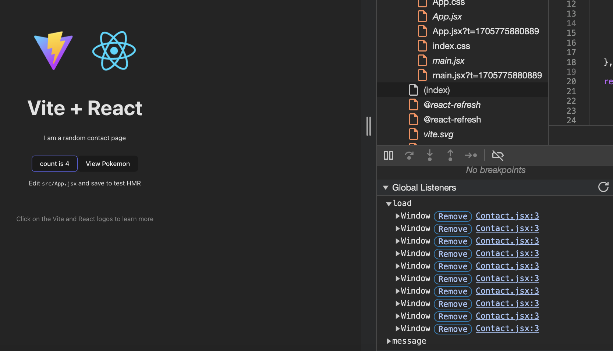
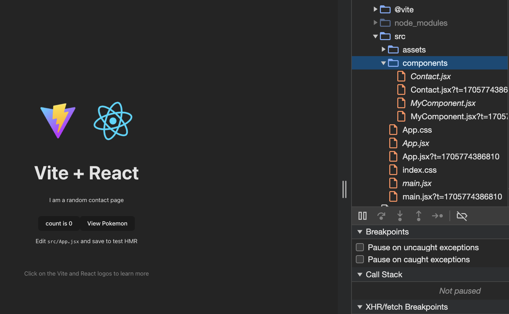
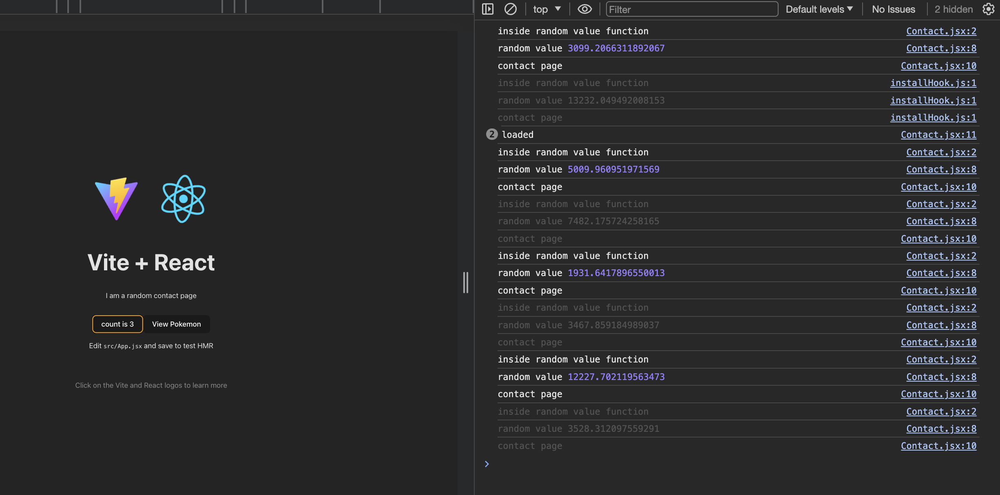

# React Optimizations
1. Event Registering multiple times  This is happening when we are click the counter.

2. Component is loading even its is not in screen in the sources tab. 

3. Random is calculated multiple times when we click on counter or switching tabs. 

Try to optimize it.